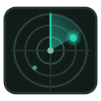

# radar



A native workspace manager: **projects in a sidebar, one tab per tool**.

Open radar and you get a real window. The sidebar lists your projects with their
git state; picking one shows that project's tabs. Each tab runs one program —
your editor, your agent, your diff — with the project as its working directory.
Switching projects switches everything, and the tabs of projects you leave stay
alive, so a running agent is never interrupted.

```
┌────────────────┬──────────────────────────────────────────────┐
│ Projects       │  Neovim │ OpenCode │ Lazygit                 │
│ ────────────── │ ──────────────────────────────────────────── │
│ api-server  ●3 │                                              │
│ web-app        │            (a real terminal,                  │
│ infra          │             running the program              │
│                │             for this project)                │
└────────────────┴──────────────────────────────────────────────┘
```

## Why a native app instead of a terminal plugin

Agents, editors and diff tools are terminal programs, and terminal programs
want a real terminal: mouse, clipboard, OSC 52, hyperlinks, key protocols. radar
gives each one an embedded terminal (VTE) inside a native window, instead of
imposing an editor's key handling on top of it.

Agents are run exactly as their authors shipped them — the CLI/TUI, in a
terminal, with the project as its working directory. No API adapters, no
reimplemented session browser: radar stays out of the way and the agent keeps
all of its own behaviour.

## Install / build

```bash
# the terminal widget the app embeds (Arch, via omarchy)
omarchy pkg add vte4

cd ~/Work/radar
cargo build --release --features vte     # full app, embedded terminals
./target/release/radar
```

`vte4` is optional: without it, build with `--features gui` and the app still
works — each tab then offers **Open in a terminal window** instead of embedding
the program. That keeps radar usable on a machine where you cannot install VTE.

## Using it

| Action | Shortcut |
| --- | --- |
| Keys & primitives overlay (open a primitive, read the keymap) | `Alt+H` |
| Move between the panes on screen | `Alt+Arrows` |
| Cycle panes — the sidebar included | `Ctrl+Tab` / `Ctrl+Shift+Tab` |
| The focused pane's menu (change program, close, move, group, split out) | `Menu` / `Shift+F10` |
| Search projects (filter, or find one to add) | `Alt+N` |
| Show or hide a primitive | `Alt+E` / `A` / `G` / `K` / `T` |
| Change the focused pane's program | `Alt+P` |
| Focus Editor / Agent / Changes / Commands | `Alt+1` – `4` |
| Preferences | `Alt+,` |
| Toggle sidebar | `Alt+B` |
| Zoom the focused pane's font | `Alt+=` / `Alt+-` (or `Ctrl+scroll`); `Alt+0` resets |
| Zoom the focused pane to the whole window | `Alt+F` |
| Refresh status | `Alt+R` |

**The keyboard drives the app, but each primitive keeps its own keys.** All of
radar's chords sit on Alt — every Ctrl key a program wants, in any panel,
reaches it untouched. The one exception is `Ctrl+Tab` for cycling: the window
manager owns `Alt+Tab`, so it never reaches the app at all. And `Alt+Arrows`
come with a rule: a text cursor — in a search box, a dialog, an agent
prompt — keeps them. radar takes the chord only when the keys belong to a
pane. Opening a panel — with a chord, the dock, or the HUD — puts the keys
straight into it. Panes and the sidebar wear a quiet ring while they hold
the keys, so you can see where they are.

**The overlay** (`Alt+H`, also in the workspace menu) floats over the
workspace: a row per primitive — open one, or see that it is already on
screen — the settings, and the whole keymap. Type to filter, arrows to move,
`Enter` to run, `Esc` to go back to the program you were looking at.
Changing a pane's program from its menu or with `Alt+P` opens program
choices in this same overlay.

**Adding a project** needs no dialog and no button: the sidebar's search box
does both jobs. It filters your projects, and below them it lists directories
under the scan root (usually `~/Work`) that match — repositories marked `git`,
each with its own **+**, so several projects can be added in one search.
Adding never leaves the search: the project joins the rows above the moment
it is added. The small `from ~/Work` label picks another directory to scan,
and `Esc` empties the search.

The **+** on the tab bar offers your preferred editor, agent, diff and shell plus
"Choose program…" (every terminal program radar can find, grouped by kind).

**Preferences** is where "preferred editor / agent / diff / shell" lives. Leave a
slot on *Auto* and radar picks the best installed one; the resolved choice is
shown next to it. There is also a switch for whether agents start with their
skip-permission flags, matching how omarchy's own keybinding launches them.

## State

Everything lives in SQLite at `~/.local/share/radar/radar.db`:

| table | what |
| --- | --- |
| `projects` | path, name, pinned, order, recency, open count |
| `tabs` | per project: slot, program, title, order, extra args |
| `workspace_state` | per project: primitive groups, active primitive, split tree, divider positions, zoom |
| `settings` | preferences (preferred programs, flag policy), UI state |
| `events` | what happened, for history and recents |

Closing the window keeps Radar running in the background, so embedded agents
remain alive. Use **Workspace → Quit** (or `Alt+Q`) to exit. The install
script adds a login autostart entry; after a reboot Radar relaunches the saved
workspace for the last selected project. Other projects restore their layouts
when selected. Their visible programs are launched again after a reboot; whether
an agent resumes its prior conversation depends on that agent's CLI support.

Set `RADAR_HOME` (or `--home`) to point at another directory — that is how the
tests stay off your real data.

## CLI

The app is also a CLI, which is handy for scripting and is how the core is
tested:

```bash
radar                       # open the app
radar list [--json]         # projects with branch, changes, tabs
radar add ~/Work/api ~/Work/web
radar add --scan ~/Work     # every repository under a directory
radar find api              # fuzzy directory candidates (fd + skim)
radar open api-server       # what its tabs resolve to, command per tab
radar agents                # agents, omarchy's default, what is installed
radar programs diff         # the registry, by kind
radar prefs                 # resolved preference per slot
radar prefs agent claude    # set one
radar pin / move / rename / remove / prune
radar board                 # the project's kanban (BOARD.md)
radar card add / claim / release / move / done / next
radar hook guard            # the board's pre-edit check, for harness hooks
radar doctor                # environment check
```

## The board

Every project has a kanban, and the kanban is a file: `BOARD.md` in the project
root, created when the project opens. Columns are `## ` headings, cards are
`- [ ]` lines, a claim is a `@name` on the card's line, indented lines under a
card are its notes.

That plainness is the point: an agent already running in the project claims
work and moves it along by editing the file with the tools it already has — no
radar API, no adapter. radar's **Board** pane (Alt+K) renders the same
file as a native kanban: drag cards between columns, click to edit, and the
pane re-reads the file whenever anyone — an agent, the CLI, `git checkout` —
writes it. The file is the board; radar is one of its editors.

For scripts that want a lock-free answer to "what should I do next":

```bash
radar card next --by claude-mx7k2b1f   # claims the first unclaimed card, prints it
radar card next --in Review --by codex-9x3k1a   # a reviewer picks up review work
radar card move "Fix login" --to Review  # hands the card over: the claim drops
```

### The convention

A board nobody is made to use is a wall decoration, so radar puts the board in
the agents' way at both ends — without touching a single agent's
configuration. When an **agent pane opens**, radar writes the convention into
the project: the board file, a skill describing the loop
(`.opencode/skills/board/SKILL.md` for opencode, `.claude/skills/board/SKILL.md`
for Claude Code, a pointer in `AGENTS.md` for the harnesses that only read
that), and a `RADAR_AGENT` environment variable — `claude-mx7k2b1f`, unique
per launch — so two instances of the same agent never hold each other's cards,
and a claim on the board says which one.

The loop the skill teaches: claim with `radar card next --by "$RADAR_AGENT"`,
work one card at a time, hand over by moving to **Review** with a note for
whoever checks, and prefer picking up Review work — a card is done when a
*different* agent closes it with `radar card done`. Moving a card drops its
claim, so the handover is real: the moment a worker's card reaches Review, the
worker's edit rights are gone until it claims again.

And the requirement has teeth, in the one place every agent already answers
to: **git**. radar installs a `pre-commit` hook in the repository's own hooks
directory (never touching a hook it did not write, never writing outside
`.git`), and the hook refuses a commit from a radar-launched agent that holds
no board claim — whatever tool the agent edited with. The refusal text is the
remedy, so the agent claims and retries. Humans in their own terminals set no
`RADAR_AGENT` and are never blocked. The check is `radar hook guard --commit`
— the same subcommand can judge a file edit for a harness that offers pre-edit
hooks, but nothing needs to be configured for the gate to hold.

## How it fits with omarchy

- **Agents**: the registry mirrors omarchy's list and its "don't stop to ask"
  flags (`claude --permission-mode auto`, `codex --approve-for-me`,
  `crush --yolo`, `cursor-agent --yolo --trust`, …). `omarchy default agent`
  decides which one leads the list; for that agent radar runs
  `omarchy agent --inline` so omarchy keeps owning the flags. `omarchy agent`
  and radar agree, always.
- **Theme**: colours come from
  `~/.local/state/omarchy/current/theme/colors.toml` and the font from your
  terminal config, so panes look like your terminal. A file monitor re-applies
  them when you switch themes.
- **Adding projects**: `fd` (with a hard-prune list and repository boundaries,
  so `node_modules` and the inside of a repo are never offered), scored with
  skim matching over name *and* path.

## Development

```bash
cargo test                  # 116 tests: store, board, skill, git parsing, registry, discovery
cargo clippy --all-targets  # clean
cargo build --features gui  # no VTE needed
```

Layout:

```
src/db/          SQLite: projects, tabs, settings, events  (+ migrations)
src/board.rs     the kanban: BOARD.md parse/render, atomic card ops
src/skill.rs     the convention: skill install, the pre-edit guard
src/programs/    program registry, omarchy agent knowledge, argv building
src/discover/    directory discovery: fd or walk, fuzzy filtering
src/git.rs       branch / ahead / behind / changed, read-only
src/gui/         window, sidebar, panes, dialogs, theme, terminal panes
src/main.rs      CLI
```

The core (`db`, `board`, `programs`, `discover`, `git`) has no GTK dependency,
so it can back other front-ends — a shell widget, a status bar, or the `--json`
output of the CLI — without duplicating any state.

## Development aids

Two environment variables exist because layout bugs are hard to see otherwise:

- `RADAR_SPLIT_ON_START=1` builds a split layout on startup (split right, then
  split down), so the pane geometry can be checked without clicking.
- `RADAR_TRACE=/tmp/radar.log` appends what happens when tabs are opened and
  panes are split, which is far easier to read than a screenshot when a widget
  does not appear.
